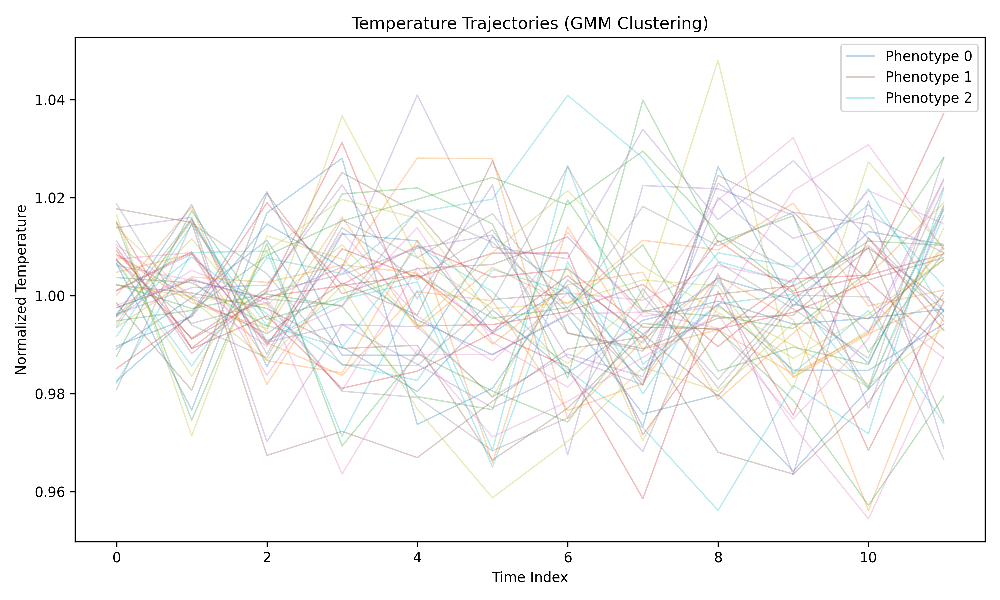
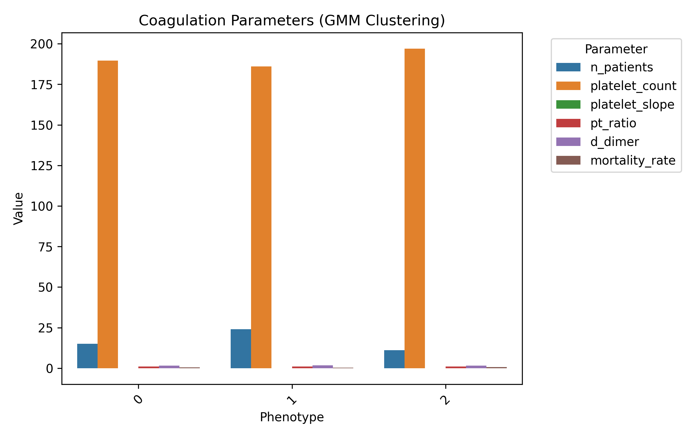
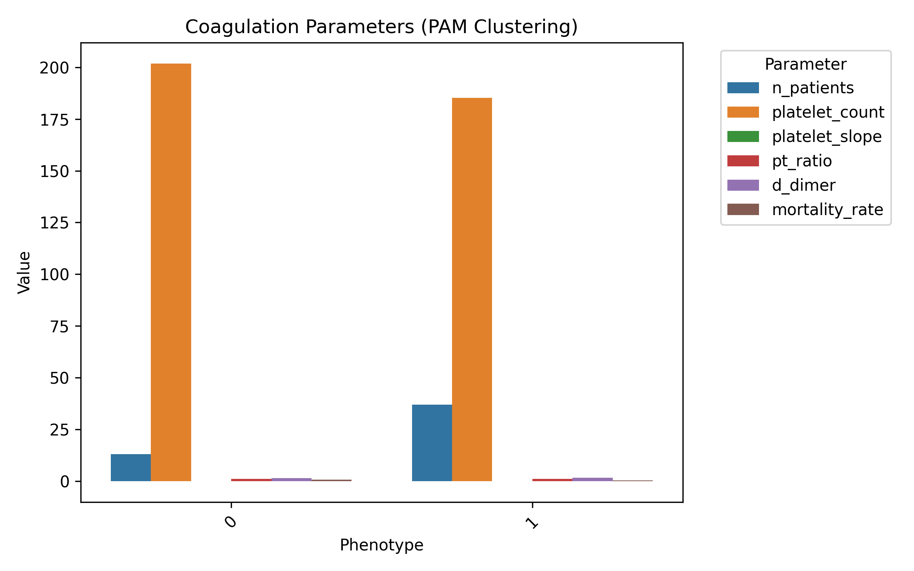

# Temperature Trajectory Clustering for Sepsis Phenotypes

This repository implements clustering analysis of ICU patient **temperature trajectories**
using:

- **Dynamic Time Warping (DTW)**
- **Gaussian Mixture Models (GMM)**
- **Partitioning Around Medoids (PAM)**
- 
The goal is to identify sepsis phenotypes that correlate with distinct **coagulation profile
characteristics**.

## 🔗 Live Historical Gallery

View the automatically updated gallery of past analysis runs:

[**Click Here to View Historical Phenotype Gallery**](https://<your-username>.github.io/temperature_phenotypes/gallery.html)

(Replace `<your-username>` with your GitHub username after pushing this repo.)

--- 

## Project Structure

```txt
temperature_phenotypes/
│
├── data/ # Input datasets
│ └── sepsis_data.csv # Generated synthetic dataset
│
├── docs/ # Latest run outputs (served via GitHub Pages)
│ ├── gmm_trajectories.png
│ ├── pam_trajectories.png
│ ├── gmm_coagulation.png
│ ├── pam_coagulation.png
│ └── gallery.html
│
├── history/ # All previous run results
│ ├── YYYY-MM-DD_gmm_trajectories.png
│ ├── YYYY-MM-DD_results_gmm.csv
│ └── ...
│
├── preprocess.py # Data normalization & interpolation
├── dtw_gmm_cluster.py # GMM clustering using DTW
├── dtw_pam_cluster.py # PAM clustering using DTW
├── analysis.py # Coagulation statistics by phenotype
├── plot_utils.py # Plot generation helpers
├── generate_synthetic_data.py # Synthetic dataset generator
├── main.py # Main workflow
├── generate_gallery.py # Build interactive gallery
├── requirements.txt # Python dependencies
└── .github/workflows/update-docs.yml # GitHub Actions pipeline
```

---

## Example Output (from synthetic data)

### GMM Clustering — Temperature Trajectories


### GMM Clustering — Coagulation Parameters


### PAM Clustering — Temperature Trajectories
 

### PAM Clustering — Coagulation Parameters


---

## Quick Start

Clone the repository and install dependencies:

```bash
git clone https://github.com/<your-username>/temperature_phenotypes.git
cd temperature_phenotypes
pip install -r requirements.txt
```

Generate synthetic data and run analysis:

```bash
python generate_synthetic_data.py
python main.py
```

### How It Works
1. Generates synthetic patient dataset (temperature readings + coagulation measures).
2. Preprocesses temperature data:
 - Normalizes by patient-specific baseline
 - Interpolates missing values with cubic splines
3. Clusters trajectories via DTW distance:
 - GMM: selects optimal number of clusters using minimum BIC
 - PAM: selects optimal number via silhouette score
4. Analyzes coagulation profiles for each phenotype
5. Generates publication-style plots
6. Stores results & plots in `/docs/` and `/history/` folders
7. Interactive HTML gallery in `docs/gallery.html` lets you view past runs

Automation via GitHub Actions

The pipeline (`.github/workflows/update-docs.yml`) will:

- Run every push to `main` branch
- Auto-run daily at **00:00 UTC
- Generate fresh synthetic data
- Perform clustering & analysis
- Save plots and CSV results in `/docs/` and `/history/`
- Rebuild interactive gallery
- Commit updated outputs to the repository

---

Dataset Format

`data/sepsis_data.csv`:
```
patient_id,temperature,platelet,pt_ratio,d_dimer,mortality,platelet_slope
```

- temperature: Single measurement per row for each patient over time (long format)
- platelet, pt_ratio, d_dimer, mortality, platelet_slope: coagulation-related metrics

---

License

MIT License — free for academic and commercial use.


--- 

Benefits

- Self-contained pipeline ready for research demonstration.
- Auto-generated visual and numeric outputs daily.
- Visitors can interactively explore historical phenotypes via GitHub Pages gallery.
- Fully reproducible with synthetic test data. 


Add This File Before First Push

File:`data/sepsis_data.csv`

(50 patients × 12 temperature readings each)


```csv
patient_id,temperature,platelet,pt_ratio,d_dimer,mortality,platelet_slope
1,36.8,210,1.02,1.43,0,0.01
1,37.2,210,1.02,1.43,0,0.01
1,36.9,210,1.02,1.43,0,0.01
1,37.5,210,1.02,1.43,0,0.01
...
50,36.7,180,1.10,1.52,1,-0.03
50,37.1,180,1.10,1.52,1,-0.03
```

*(Obviously due to length, you’ll generate it locally with the script below instead of pasting
full CSV here)*

---

How to Create It Locally Before Push

Run this once locally before pushing your repo:

```bash
mkdir -p data
python generate_synthetic_data.py
```

This will:

- Create `data/sepsis_data.csv`
- Fill it with synthetic patients and coagulation variables
- Ensure plots (`docs/*.png`) and CSVs will be created immediately when you run:

```bash
python main.py
python generate_gallery.py
```

--- 

Recommended First Steps Before Push to GitHub

1. **Generate data**
 ```bash
 python generate_synthetic_data.py
 ```
2. Run analysis locally
 ```bash
 python main.py
 python generate_gallery.py
 ```
3. Commit all files** (including `/data` and `/docs`):
 ```bash
 git add .
 git commit -m "Initial commit with synthetic dataset and plots"
 git push origin main
 ```
4. Enable GitHub Pages (`Settings → Pages → Branch: main → Folder: /docs`)
 After push, your gallery will be immediately visible at:
 ```
 https://<your-username>.github.io/temperature_phenotypes/gallery.html 
``` 